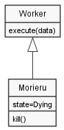
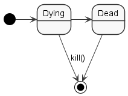

# Morieruデザインパターン

- MorieruはWorker(-Thread)のエイリアスです。
- 通常の利用ではWorkerに相当するクラスの継承のみを行い、他に付け加えるものは何もありません。
- 必要に応じて状態を定義することができます。意味はありませんが。
  - 但し初期状態は"Dying"でなくてはなりません(MUST)。
    - 注意！間違っても"Alive"などとしないように！！
  - 状態の管理は遷移先を"Dead"のみとするか、killメソッドによる強制終了が可能であることを推奨します。

Morieruをできるだけ酷使することに重点を置いてください。
